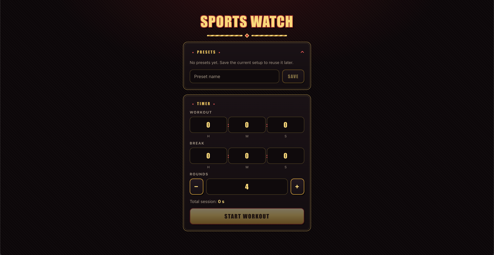

# Sports Watch

A minimal, mobile friendly interval timer for gym workouts. Set a workout time, a break time, and a number of rounds, then let it auto cycle: work, break, work, break, until you are done. Save the setup as a preset so the next session is one tap away.



## Run locally

Requires [Bun](https://bun.sh).

```bash
bun install
bun run dev
```

Open the printed URL (use your phone on the same network for mobile testing).

Production build:

```bash
bun run build
bun run preview
```

Type checking and tests:

```bash
bun run typecheck
bun test
```

### Pages setup

Only needed if you fork the repo or deploy your own copy. GitHub Pages must build the site from the GitHub Actions workflow instead of serving files from a branch.

1. Push the repository to GitHub.
2. Open the repository Settings, then Pages.
3. Under Build and deployment, set Source to **GitHub Actions**.
4. Push to `main` (or run the workflow manually from the Actions tab).

The site uses a relative base path (`base: "./"` in `vite.config.ts`), so it works at any repository sub path.

Troubleshooting:

- **Blank page, console error about `/src/main.tsx` and a disallowed MIME type**: GitHub Pages is serving the repository source instead of the production build. Set Source to **GitHub Actions** as described above, then re run the workflow (Actions tab, Deploy to GitHub Pages, Run workflow).
- **Workflow fails with "Ensure GitHub Pages has been enabled"**: same cause as above. The build job succeeds, only the deployment step needs the Source setting above.

## Features

- Workout timer with hh:mm:ss input
- Break timer with hh:mm:ss input
- Configurable number of rounds (1 to 99)
- Auto cycling session: workout, break, workout, and so on, ending after the final round
- Pause, resume, skip phase, and stop controls during a session
- Phase alerts: sound (Web Audio API), vibration, and a full screen color flash (red for work, gold for break, pink for the finish)
- Round progress dots, phase progress bar, and a hint of what comes next
- Save the current setup as a preset, load a preset with one tap, delete presets you no longer need
- The presets panel collapses to save space, and the loaded preset stays highlighted until you edit the timer
- Presets persist in localStorage, no account required
- Wake Lock keeps the screen on while a session is running (where supported)
- Timestamp based countdown, so a throttled background tab still lands on the right phase
- Fully responsive, works from 320px up, optimised for phone use

## Tech stack

- [Bun](https://bun.sh) runtime and package manager
- [React 19](https://react.dev)
- [TypeScript](https://www.typescriptlang.org)
- [Vite 7](https://vite.dev) dev server and bundler
- Plain CSS, no UI framework
- Browser APIs: localStorage, Web Audio API, Vibration API, Wake Lock API

## Testing

Tests follow the [testing trophy](https://kentcdodds.com/blog/the-testing-trophy-and-testing-classifications) approach: a strong static base, the widest band of unit and integration tests in the middle, and a deliberately thin top.

| Layer | Coverage | Command |
| --- | --- | --- |
| Static | TypeScript compiler over app and tests | `bun run typecheck` |
| Unit | Time helpers, timer engine phase transitions, preset storage validation | `bun test` |
| Integration | Setup form, presets (save, collapse, highlight, delete), and the full workout workflow rendered in a happy DOM | `bun test` |
| End to end | Kept thin on purpose: the deploy workflow runs typecheck, tests, and a production build on every push to `main` | automatic |

```bash
bun test
```

## Deploy to GitHub Pages

The repo includes a GitHub Actions workflow at `.github/workflows/deploy.yml` that typechecks, runs the tests, builds, and publishes to GitHub Pages on every push to `main`.

## Credits

- Trashcan icon by Cédric Villain from the Noun Project (icon 888071).
